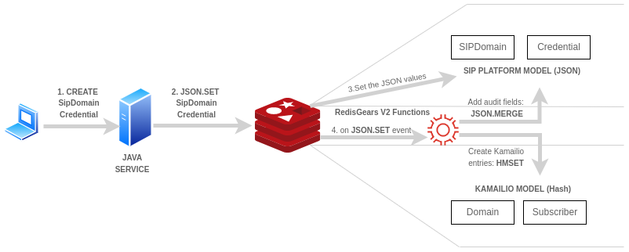
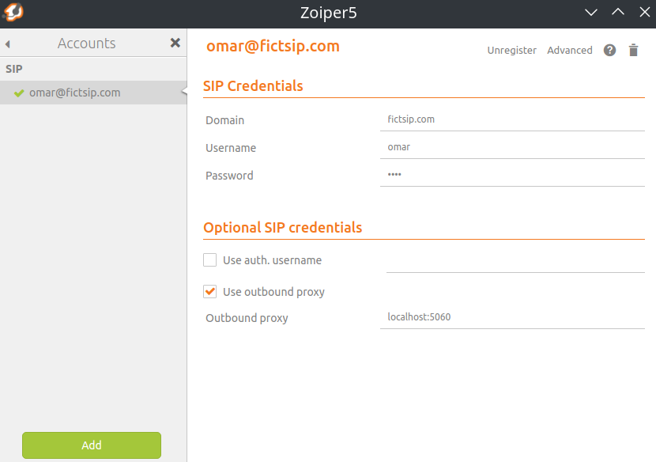

## A SIP Domain Management Application with Java, Redis, Redis OM Spring, Redis Gears V2, and Kamailio

The goal is simply to experiment with the [Redis Gears 2 (Triggers and Functions) prerelease](https://github.com/RedisGears/RedisGears/releases/tag/v2.0.15-m16), 
which includes V8 JavaScript Engine support, allowing us to subscribe JavaScript functions that automatically execute code on data changes directly in the Redis database.

Disclaimer: This project is all about the exploration rather than the end result. 

## Scenario
We will be developing a SIP domain management application to facilitate user registration and connection to a SIP domain.

Having chosen Redis as our backend database and Kamailio to manage SIP communications, our primary goal is to develop a real-time synchronization system that ensures consistent and accurate data
between our custom SipPlatform business model and the required Kamailio model.



## Description

Our business logic is composed of two main components:

1. **Java Service:** It serves as the primary interface for data manipulation.
2. **Redis Gears V2 functions:** to ensure that any changes in the business model are promptly reflected in Kamailio's configuration for SIP registration and management.

Our **custom domain model** is inspired by the [Twilio SIP API](https://www.twilio.com/docs/voice/sip/api), focusing primarily on two classes:
[SipDomain](backend/src/main/java/es/omarall/sip/platform/sipdomains/SipDomain.java) and [Credential](backend/src/main/java/es/omarall/sip/platform/credentials/Credential.java).

With support from [Spring OM Redis](https://github.com/redis/redis-om-spring), built on [Spring Data Redis](https://github.com/spring-projects/spring-data-redis), we will effectively map our Java model to RedisJSON documents.
[RedisJSON](https://redis.com/modules/redis-json/) module, will enable us to use Redis as a high-performance NoSQL document database. SipDomain and Credential models will be stored as JSON documents.

We plan to use Redis Gears v2 to subscribe JavaScript functions to [keyspace notifications](https://redis.io/docs/manual/keyspace-notifications/) which will help us:

* include auditing metadata into our SIPPlatform domain entities.
* ensure Kamailio's configuration consistency, as any updates to our domain entities will be immediately delivered.

## Redis Gears V2 Functions
A more detailed description [here](redis-functions/README.md).

## SipPlatform Java Service
A more detailed description [here](backend/README.md).

## SIP Domain Implementation with Kamailio and Redis

[Kamailio](https://www.kamailio.org/) is a powerful SIP (Session Initiation Protocol) server that can be customized to handle a wide range of SIP-related functionalities.

While Kamailio supports various databases, we're specifically choosing [Redis](https://www.kamailio.org/docs/modules/devel/modules/db_redis.html) for our example.

To enable Redis as the database backend for Kamailio, specific configurations need to be set. 
Here's an overview of what the Kamailio configuration file for Redis might look [here](environment/README.md).

## Prerequisites
* Node.js (v18.18.0) and npm(9.8.1) installed
* Redis Stack Server running with Key Space Notifications enabled: `CONFIG SET notify-keyspace-events KEA`
* Maven (3.8.3) and Java (11) installed
* docker and docker-compose

## Usage
1. Start Redis Stack Server and Kamailio instances with [docker-compose](environment/docker-compose.yml):

```bash
$ cd environment
$ docker-compose up
```

2. Start the [Redis Insights](https://docs.redis.com/latest/ri/installing/install-redis-desktop/) gui, start the profiler, open the CLI and run the following command in order check whether *keyspace events notifications* are enabled:

```text
CONFIG GET notify-keyspace-events
# CONFIG SET notify-keyspace-events KEA
```

3. Deploy javascript code to Redis Stack server:
```bash
$ cd redis-functions
$ npm install
$ npm run deploy
> redis-functions@1.0.0 deploy
> gears-api index.js

Deployed! :)
```

4. Run the java backend application. This will create the necessary Redis indexes.
(If you flush all redis data, be sure to rerun it in order to recreate the indexes

```bash
$ cd backend
$ mvn spring-boot:run
```

5. Try creating a SipDomain, a Credential entities and request a DomainReload to Kamailio:

```text
POST http://localhost:8080/domains
{
    "name": "fictsip.com"
}
```

```text
POST http://localhost:8080/credentials
{
    "domain": "fictsip.com",
    "username": "omar",
    "password": "omar"
}
```

```text
POST http://localhost:5060/RPC
{
    "jsonrpc": "2.0",
    "method": "domain.reload",
    "id": 1 # increment this id for each request
}
```

A postman collection is provided: 

[](https://www.postman.com/blue-station-895244/workspace/sipplatform/collection/9271443-c56ff492-eaa2-4c25-9373-0994165d22f0?action=share&creator=9271443)


7. Try SIP registration to the created domain with the created credentials with a soft phone.


